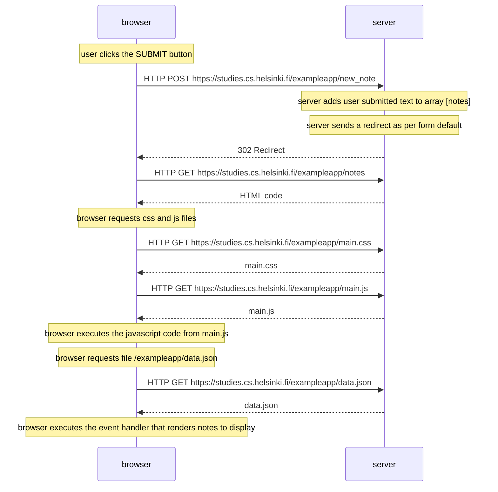

```mermaid
sequenceDiagram
note over browser:user clicks the SUBMIT button
browser->>server: HTTP POST https://studies.cs.helsinki.fi/exampleapp/new_note
note over server:server adds user submitted text to array [notes]
note over server:server sends a redirect as per form default 
server-->>browser: 302 Redirect
browser->>server: HTTP GET https://studies.cs.helsinki.fi/exampleapp/notes
server-->>browser: HTML code
note over browser:browser requests css and js files
browser->>server: HTTP GET https://studies.cs.helsinki.fi/exampleapp/main.css
server-->>browser: main.css
browser->>server: HTTP GET https://studies.cs.helsinki.fi/exampleapp/main.js
server-->>browser: main.js
note over browser:browser executes the javascript code from main.js
note over browser:browser requests file /exampleapp/data.json
browser->>server: HTTP GET https://studies.cs.helsinki.fi/exampleapp/data.json
server-->>browser: data.json
note over browser:browser executes the event handler that renders notes to display
```