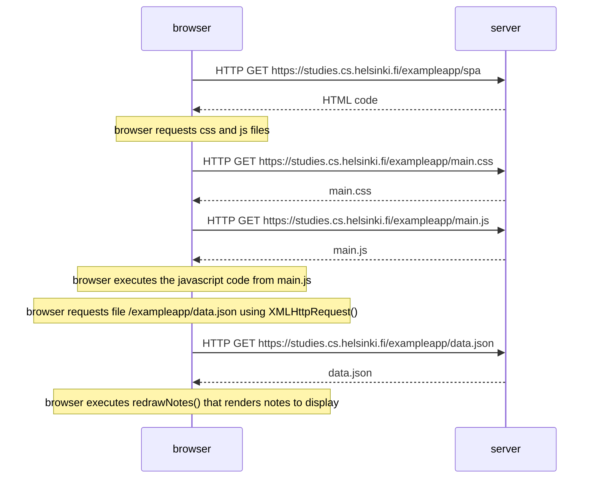

```mermaid
sequenceDiagram
browser->>server: HTTP GET https://studies.cs.helsinki.fi/exampleapp/spa
server-->>browser: HTML code
note over browser:browser requests css and js files
browser->>server: HTTP GET https://studies.cs.helsinki.fi/exampleapp/main.css
server-->>browser: main.css
browser->>server: HTTP GET https://studies.cs.helsinki.fi/exampleapp/main.js
server-->>browser: main.js
note over browser:browser executes the javascript code from main.js
note over browser:browser requests file /exampleapp/data.json using XMLHttpRequest()
browser->>server: HTTP GET https://studies.cs.helsinki.fi/exampleapp/data.json
server-->>browser: data.json
note over browser:browser executes redrawNotes() that renders notes to display
```