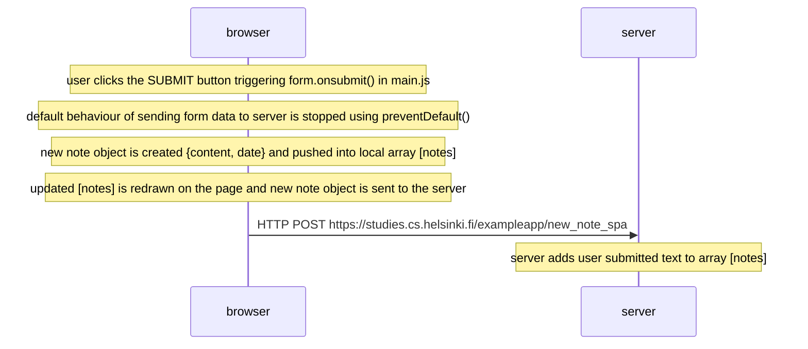

```mermaid
sequenceDiagram
note over browser:user clicks the SUBMIT button triggering form.onsubmit() in main.js
note over browser:default behaviour of sending form data to server is stopped using preventDefault()
note over browser:new note object is created {content, date} and pushed into local array [notes]
note over browser:updated [notes] is redrawn on the page and new note object is sent to the server
browser->>server: HTTP POST https://studies.cs.helsinki.fi/exampleapp/new_note_spa
note over server:server adds user submitted text to array [notes]

```
